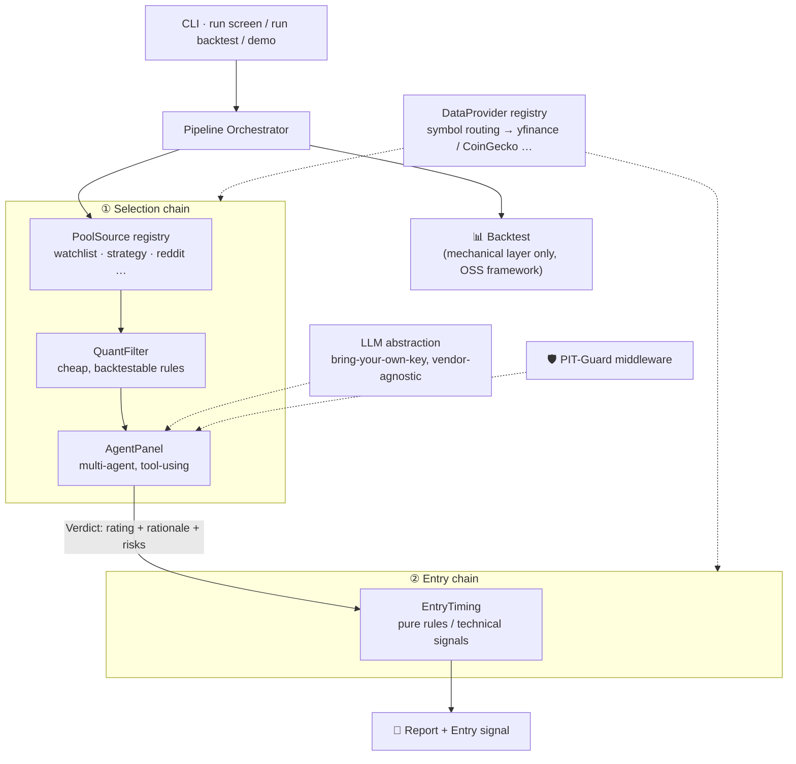

<div align="center">

# 🔭 AlphaAgent

**An asset-agnostic, multi-agent stock & crypto screening framework — with an honest backtest and a leakage-aware agent layer.**

*Pluggable pools → cheap quant filter → multi-agent due diligence → rule-based entry timing.*

[](LICENSE)
[]()
[]()

[中文说明](README_zh.md) · [Contributing](CONTRIBUTING.md)

</div>

> 🚧 **Pre-alpha.** APIs may still change. Nothing here is investment advice — see the [disclaimer](#-disclaimer).

---

## Why another trading-agent repo?

GitHub has plenty of LLM trading bots. Most share the same two blind spots: they **can't be honestly backtested**, and their agents **quietly read the future** (the model already knows what happened; live web search returns post-date news). AlphaAgent is built around fixing exactly that.

**Four things no comparable project does all of:**

| | What it means |
|---|---|
| 🧱 **Mechanical / agent separation** | The number that proves edge (backtest) runs on deterministic rules only — the LLM is *bypassed*, so agent hallucination can't inflate your equity curve. |
| 🔌 **Pluggable collaboration** | `panel` (parallel experts + judge), `debate` (bull vs bear), `vote` — swap the multi-agent topology from config, don't rebuild the orchestration. |
| 🪙 **Asset-agnostic** | Stocks and crypto through one symbol-routing + provider registry. Add a market = drop one loader file. |
| 🛡️ **PIT-Guard** | A point-in-time middleware that intercepts every agent tool call, enforces `data timestamp ≤ as-of date`, and mitigates the model's own parametric leakage (anonymization + evidence-grounding + a leakage probe). |

---

## How it works

Two independent gates — **AI for the qualitative call, rules for the timing** — never mixed:



1. **Pool** — pluggable sources produce a candidate universe (multi-source hits are flagged as signal resonance).
2. **Filter** — cheap quantitative rules compress the pool to a handful; output is a *scored table*, not pass/fail.
3. **Agents** — only survivors go to the expensive layer: specialist agents (fundamental / technical / sentiment / risk) analyze in parallel via tools, a judge aggregates a structured `Verdict`.
4. **Entry** — pure technical/rule signals decide *when* — `buy / wait / pass` + trigger price. No LLM here.

---

## Quickstart

```bash
git clone https://github.com/kamendula/AlphaAgent.git && cd AlphaAgent
make demo        # runs the whole chain on bundled offline snapshots — zero keys, zero network, zero install
```

Want live data + a real LLM? Point at a config (free sources like yfinance need no key; set `FMP_API_KEY` / `OPENROUTER_API_KEY` in `.env` for FMP + OpenRouter):

```bash
python -m alphaagent screen --config configs/real.toml
python -m alphaagent backtest --symbol NVDA --config configs/demo.toml
```

> The multi-agent panel **runs in the demo** via a deterministic offline mock LLM — no keys needed.
> Swap `llm = "mock"` → `"openrouter"` / `"openai"` in the config for real reasoning.
> Configs are TOML (parsed by the stdlib on Python 3.11+, so the demo needs no YAML library).

---

## Sample run

A live run (`configs/real.toml`: FMP market data + fundamentals + news, the HY model via OpenRouter, PIT-Guard on). The mechanical filter ranks the universe, then only the top candidates go to the agent panel; entry timing is pure rules:

```text
 #  SYMBOL   TYPE    SCORE  FACTORS                                      SOURCES
 1  AAPL     equity  0.644  trend=0.82 momentum=0.91 not_overbought=0.20  real
 2  GOOGL    equity  0.594  trend=0.47 momentum=0.82 not_overbought=0.50  real
 3  NVDA     equity  0.584  trend=0.21 momentum=0.65 not_overbought=0.90  real
 ...

Agent panel verdicts
--------------------
AAPL  ->  BUY  (confidence 0.31)
    · fundamental  cautious  High net margin (26.6%) & revenue +16.6%, but EPS not accelerating and PE 30.8 rich.
    · technical    bullish   Above 50-day SMA (313.9 vs 295.1), 60d momentum +20.5%, RSI 61.8 — strong, not overbought.
    · sentiment    neutral   Mildly positive mega-cap tech tone; no symbol-specific catalyst.
    · risk         neutral   ATR 2.8%, 60d drawdown -12.7%, RSI not crowded — clean.

GOOGL ->  AVOID  (confidence 0.28)
    · fundamental  neutral   Revenue +21.8%, net margin 56.9%, PE 13.9 reasonable — but EPS decelerating.
    · technical    cautious  Below the 50-day SMA; mixed momentum.
    · risk         cautious  16.2% drawdown + elevated ATR 3.2%.

Entry signals (rule-based, no agent)
-----------------------------------
    AAPL   WAIT  trigger=300.10   extended 4.6% above EMA — wait for a pullback
    GOOGL  PASS                   uptrend broken (close 369.69 <= sma50)

🛡️  PIT-Guard: leakage probe 0.00 (clean); agent tools bounded to as-of, evidence-grounded.
```

The offline `make demo` produces the same shape instantly (mock LLM + bundled snapshots), so anyone can reproduce the flow with zero setup.

---

## The moat: PIT-Guard 🛡️

Leakage comes in two flavors. AlphaAgent treats them separately:

**① Tool/data leakage — 100% enforceable.** A middleware sits at the tool boundary and guarantees every agent only sees data timestamped on or before the as-of date: price series truncated, news date-filtered, fundamentals served as *point-in-time* snapshots (as-reported, not restated).

**② Parametric leakage — the model already knows the future.** You can't delete it from the weights, so AlphaAgent *bounds* it:
- **Anonymization** — strip ticker/company name; the agent judges *"this anonymous security with these features"*, not *"NVDA, which I know 10×'d"*.
- **Evidence-grounding** — every claim must cite an `evidence_ref` from a guarded tool; ungrounded recall is rejected.
- **Post-cutoff evaluation + leakage probe** — historical agent eval runs only on dates after the model's training cutoff, with a probe that measures residual contamination.

And crucially: **the headline backtest never includes the agent**, so parametric leakage can't touch it.

---

## Extending it (one file + one line)

Every extension point is a registry plugin:

```python
from alphaagent.data import register, DataProvider

@register("myexchange")
class MyExchangeProvider(DataProvider):
    def get(self, kind, symbol, as_of): ...
```

The same pattern works for `PoolSource`, `QuantFilter`, `Analyst` roles, `CollaborationPolicy`, and `EntryRule`. See [`examples/`](examples/) for a reference implementation of each, and [CONTRIBUTING.md](CONTRIBUTING.md).

---

## Optional: MCP server

AlphaAgent ships a thin, optional [MCP](https://modelcontextprotocol.io) server so clients like Claude Code can call it directly. It exposes `get_prices`, `classify_symbol`, `screen`, and `list_providers`, delegating to the same code the CLI uses. It is not imported by any default path and needs the `mcp` SDK only when actually run.

```bash
pip install "alphaagent[mcp]"
python -m alphaagent.mcp          # serves over stdio
```

```jsonc
// e.g. Claude Code / Claude Desktop MCP config
{ "mcpServers": { "alphaagent": { "command": "python", "args": ["-m", "alphaagent.mcp"] } } }
```

## 🗺️ Roadmap

- [x] **M0** — core registries + data model + yfinance provider + `make demo`
- [x] **M1** — selection chain: pool + filter + `panel`/`vote`/`llm_judge` collaboration + 4 analysts + vendor-agnostic LLM (offline mock) + FMP provider
- [x] **M2** — entry rules (`breakout`/`pullback`) + backtest adapters (`simple` stdlib + optional `backtesting.py`) + mechanical-layer report + `alphaagent backtest`
- [x] **M3** — PIT-Guard: boundary (`GuardedRouter`) + anonymization + evidence-grounding + leakage probe
- [x] **M4** — `debate` policy · optional [MCP server](#optional-mcp-server) · editable prompt files (`agents/prompts/*.md`) · reference examples for every extension point

---

## ⚠️ Disclaimer

AlphaAgent is a **research and educational** framework. It does **not** place real orders and is **not** investment advice. Markets are risky; you are responsible for your own decisions.

## License

MIT — see [LICENSE](LICENSE).
